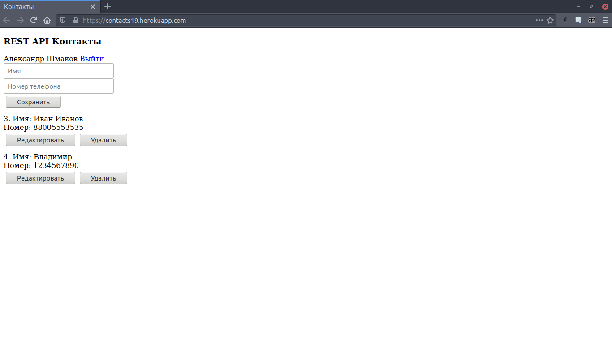

# REST API Контакты
Приложение реализует функциональность списка контактов.
Приложение загружено на веб-хостинг Heroku: https://contacts19.herokuapp.com/

## Функции приложения
- Авторизация через Google
- Сохранение сессии пользователя
- Логаут аккаунта пользователя
- Добавление в базу данных записей с полями ***имя контакта*** и ***номер контакта***
- Редактирование существующей записи
- Удаление записи
## Используемые технологии
- Spring Boot
- Spring Boot Security
- OAuth2
- Thymeleaf
- Postgresql
- Lombok
- Maven